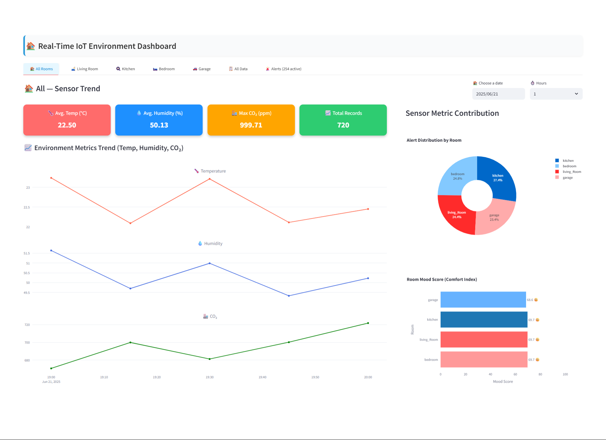
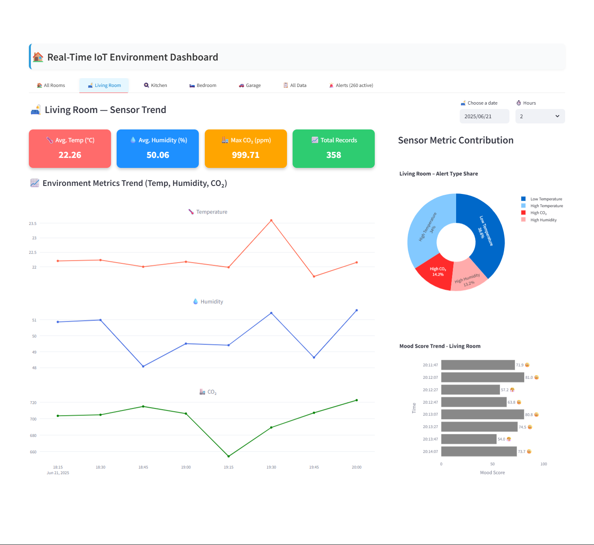
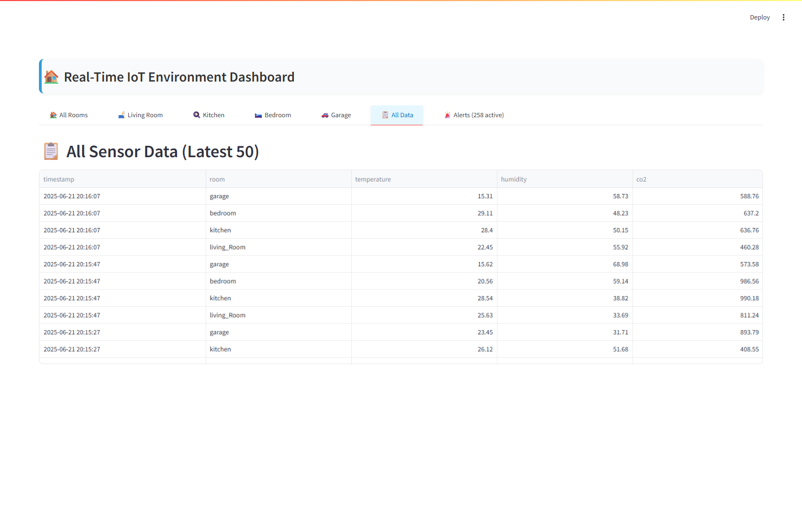
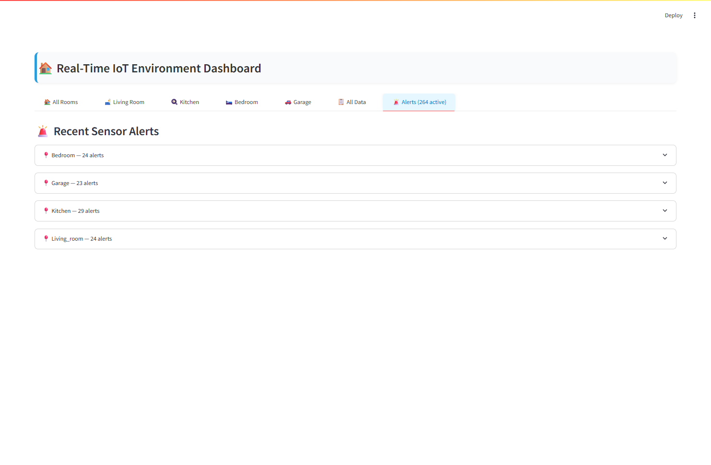

# Real-Time IoT Streaming Analytics Dashboard

A production-grade real-time monitoring dashboard built using **Streamlit**, **SQLite**, and **Plotly**, designed to visualize, analyze, and score environmental conditions from IoT sensor data. The system supports modular data ingestion, mood scoring, dynamic visualization, and future-ready alerting — all in a clean and extensible architecture.

---

## 📌 Project Overview

**Objective:**  
To develop a real-time streaming analytics solution for environmental monitoring using simulated IoT sensor data across multiple rooms. The dashboard visualizes temperature, humidity, and CO₂ levels, computes a composite comfort score (Mood Score), and supports filtering, performance indicators, and future alert logic.

---
## 🖼️ Dashboard Preview


view other tabs screenshot at the end of the file!

## 🧠 Use Case & Problem Statement

Smart environments (homes, offices, data centers) require continuous monitoring of indoor air quality and comfort. Most solutions lack real-time insights, meaningful aggregation (e.g., comfort scoring), or visual clarity.  
This project addresses that by combining **real-time stream simulation**, **composite metric design**, and **highly interactive visualizations** in a lightweight, local-first setup.

---

## 🔁 Data Pipeline

```
Sensor Publisher ──► MQTT Broker ──► Subscriber ──► SQLite DB
                                                   │
                                      [Mood Score Computation]
                                                   │
                        Streamlit Dashboard ◄───── Line | KPI | Pie | Bar
```

---

## 📦 Tech Stack

| Layer         | Tool/Tech         | Purpose                                               |
|---------------|-------------------|-------------------------------------------------------|
| Data Source   | Python script     | Simulated IoT publisher                               |
| Messaging     | MQTT(paho-mqtt)   | Lightweight pub-sub for streaming sensors             |
| Stream Broker | Subscriber script | Lightweight pub-sub for streaming sensors             |
| Storage       | SQLite            | Lightweight embedded DB                               |
| Backend       | Pandas            | Data manipulation & aggregation                       |
| Frontend      | Streamlit         | Real-time UI rendering                                |
| Charts        | Plotly            | Interactive KPI, line, pie, bar                       |

---

## 🛰️ MQTT Integration

This system uses **MQTT (paho-mqtt)** to simulate a realistic IoT streaming setup:

- `publisher.py` → publishes sensor readings to MQTT topics
- `subscriber.py` → subscribes to those topics and stores data using `sqlite_writer.py`
- Dashboard reads from the local SQLite database

This modular design allows easy swap-in for real-world brokers like **Mosquitto**, **HiveMQ**, or AWS IoT Core.

---

## ⚙️ Features

- 📡 Real-time sensor ingestion with dynamic refresh
- 📊 KPI metrics (temperature, humidity, CO₂)
- 📈 Time-series line chart (with selectable metrics)
- 🧩 Pie chart showing % metric contribution
- 📉 Horizontal bar chart visualizing per-room and per-timestamp **Mood Score**
- 🌡️ Mood Score: weighted comfort index (custom formula)
- 🗂️ SQLite-backed persistent storage

---

## 🧮 Mood Score Formula

A weighted comfort score from 0 to 100:

```
Mood Score = 100 - (
    |Temp°F - 72| × 1.2 +
    |Humidity - 40| × 0.8 +
    |CO₂ - 450| × 0.05
)
```

- The closer to 100, the more comfortable the environment.
- Scores are visually represented with emojis: 😌 🙂 😐 😤 🫠

---

## 📁 Project Structure

```
├── dashboard/
│   ├── dashboard.py          # Main Streamlit app
│   ├── components.py         # All modular chart logic
│   ├── alert.py              # Alert module logic 
│   └── csv_dashboard.py      # initial basic dashboard using csv
│
├── data_simulator/
│   └── publisher.py          # Sensor simulator script
│
├── storage/
│   └── sensor_data.db        # Local SQlite db for sensor data
│   └── alert_log.db          # Local SQlite db for alert log 
│
├── stream_consumer/
│   └── sqlite_writer.py      # Sensor simulator script
│   └── csv_writer.py         # Sensor simulator script
│   └── subscriber.py         # Sensor simulator script
│
├── requirements.txt          # Python package dependencies
└── README.md
```

---

## 🔧 How to Run the Project

```bash
# Step 1: Create and activate environment
python -m venv venv
source venv/bin/activate  # On Windows: venv\Scripts\activate

# Step 2: Install required libraries
pip install -r requirements.txt

# Step 3: Run the subscriber (listens to MQTT and writes to DB)
python stream_consumer/subscriber.py

# Step 4: Run the publisher (simulates sensor data via MQTT)
python data_simulator/publisher.py

# Step 5: Launch dashboard (reads from SQLite)
streamlit run dashboard/dashboard.py

```

---

## 🧪 Testing & QA

- ✅ Verified on Python 3.12
- ✅ Platform tested (Windows 11)
- ✅ Compatible with Chrome/Edge
- ✅ DB write-read stress-tested for 5K+ rows
- ✅ Still pending: alert system and download function

---

## 🚀 Planned Enhancements

| Feature                       | Status         |
|-------------------------------|----------------|
| 🌈 Theme toggle              | Optional        |
| 🧠 Predictive insights (ML)  | Future release  |

---

## 🖼️ Dashboard Preview





